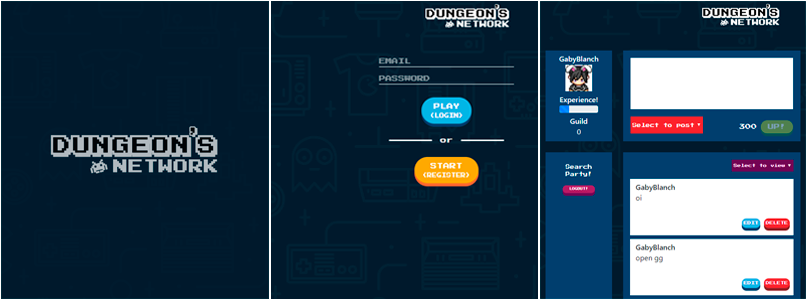

# Dungeon Network

É uma rede social para as pessoas trocarem dicas, reviews e conteúdos relacionados a games.

## Motivo
Este é o produto final do sprint 3 do bootcamp Laboratoria.

Trabalhando em duplas (@dayraroberta), tinhamos que criar uma rede social com conceito de mobile first, tema livre e deveriamos utilizar o firebase para criar um sistema de registro e login, possibilitar seguir outros usuários, publicar, editar e deletar mensagens que podem ser visualizadas em três formas diferentes a partir de um filtro, sendo elas, suas prórpias mensagens, as dos amigos seguidos, e mensagens públicas.

## Aparência

